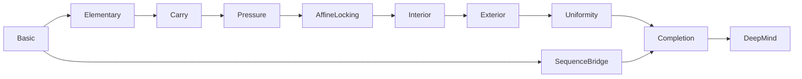

# Erdős Problem 260 in Lean

This repository contains a complete Lean 4 / Mathlib formalization of the
positive-dyadic-density argument that resolves Erdős Problem 260. It
accompanies version 2 of:

> Han Wang, *Positive dyadic density for rational weighted binary expansions*,
> arXiv:2606.24972 (v2).

The permanent paper record is
[arXiv:2606.24972](https://arxiv.org/abs/2606.24972). The detailed correspondence
between the paper's 39 labelled declarations and Lean is recorded in
[`blueprint.md`](blueprint.md).

## Status

- Lean `v4.32.0` and Mathlib `v4.32.0` are pinned.
- All 38 labelled paper results are proved, and the labelled mass definition is
  implemented with its intended measure-theoretic semantics.
- The public theorem `Erdos260.erdos_260` has the exact right-hand-side type of
  the DeepMind Formal Conjectures statement.
- The project contains no `sorry`/`admit` proof placeholders and introduces no
  mathematical `axiom` or `opaque` stand-in.
- `Erdos260/SkeletonAudit.lean` checks all 39 paper labels, the public endpoint,
  and the principal executable regression examples.

## The mathematical statements

The main density theorem, `Erdos260.thm_main_density`, says that for every
positive denominator `Q` there is a constant `cDensity(Q) > 0`, uniform over
the numerator and the infinite support `S`, such that rationality of

```text
sum (n in S) n / 2^n
```

forces every sufficiently large dyadic block `(2^L, 2^(L+1)]` to contain at
least `cDensity(Q) * 2^L` points of `S`.

The final public endpoint is:

```lean
theorem Erdos260.erdos_260 :
    ∀ a : ℕ → ℤ, ∀ s : ℝ,
      StrictMono a →
      Tendsto (fun n => (a n : ℝ) / n) atTop atTop →
      HasSum (fun n => (a n : ℝ) / 2 ^ a n) s →
      Irrational s
```

This deliberately preserves the original `n = 0` division and integer
exponent semantics of the Formal Conjectures formulation. The repository does
not depend on the Formal Conjectures package.

## Proof architecture

The imports form an acyclic chain. The sequence/support bridge is kept on a
separate branch so that the analytic reindexing does not create an import
cycle.



| Module | Mathematical role |
|---|---|
| `Basic` | Support, digits, dyadic blocks, gap words, window systems, parameter hierarchy, and measure spaces |
| `Elementary` | Composition entropy, lattice determinant, Farey separation, word cylinders, and quantitative entropy |
| `Carry` | Integral carry recurrence, support-gap control, and nonnegative mass via `lintegral` |
| `Pressure` | Sparse-block pressure lower bound and bounded-excess estimate |
| `AffineLocking` | Initial-prefix census, lattice collinearity, affine evolution, and the interior/exterior dichotomy |
| `Interior` | Odd-denominator segments, greedy logarithmic blocks, encoding uniqueness, source fibres, and interior mass |
| `Exterior` | Distance amplification, first-exit records, raw-parameter counting, and exterior mass |
| `Uniformity` | Uniform error functions and the denominator-level constant hierarchy |
| `SequenceBridge` | Reindexing a strictly increasing sequence as a support sum |
| `Completion` | Exact measurable partition, integrated upper bound, positive dyadic density, and the natural-sequence corollary |
| `DeepMind` | Finite-prefix/tail bridge from integer-valued sequences to the exact public endpoint |

The argument's main line is:

1. Assuming a weighted binary expansion is rational gives an integral carry
   recurrence and quantitative control of its gaps.
2. A sparse dyadic block forces a positive lower bound for an integrated
   high-excess mass (`prop_pressure`).
3. Repeated initial words lock carry states onto affine lines; every genuine
   continuation is partitioned into bounded, rare, interior, or exterior
   behaviour.
4. Interior encodings and exterior first-exit records bound the two difficult
   mass contributions uniformly.
5. The exact source decomposition and uniform error bounds give an upper bound
   incompatible with pressure, proving `thm_main_density`.
6. Superlinear growth makes the support dyadically sparse, contradicting the
   density theorem under a rationality assumption. Finite-prefix removal then
   yields `erdos_260` in its integer-valued form.

## Trust and axioms

This is not a claim of axiom-free constructive mathematics. Lean reports that
the final theorem depends only on the standard foundations used throughout
Mathlib:

```text
propext
Classical.choice
Quot.sound
```

In particular, the transitive axiom audit for `Erdos260.erdos_260` contains no
`sorryAx` and no project-specific mathematical axiom. The usual trusted base
is the Lean kernel and the pinned Lean/Mathlib toolchain. The proof does not
attempt to verify the Lean kernel itself.

CI also runs two resource-isolated checker jobs. `leanchecker` replays every
project module in a separate process, serially, so that imported Mathlib
environments do not accumulate in memory. Nanoda independently checks every
non-internal declaration in the `Erdos260` namespace and its recursive
dependency closure using its Rust kernel. The Nanoda job pins its compatible
version-2 exporter and streams this project closure instead of materializing
the approximately 6 GB whole Mathlib environment.

## Building

Install [elan](https://github.com/leanprover/elan), then run from the repository
root:

```console
lake exe cache get
lake build --wfail
lake env lean --trust=0 Erdos260/SkeletonAudit.lean
```

On Windows PowerShell the same commands apply:

```powershell
Set-Location path\to\erdos260-formalization
lake exe cache get
lake build --wfail
lake env lean --trust=0 Erdos260/SkeletonAudit.lean
```

The GitHub Actions workflow repeats the full build and runs the declaration
audit with `--trust=0`, rejects proof placeholders and project-level axiom
declarations, checks that the endpoint's transitive axiom list is contained in
the three standard axioms displayed above, replays every project module with
`leanchecker`, and checks every project declaration with Nanoda's independent
kernel.

## Repository layout

```text
.
├── Erdos260.lean                 # aggregate public import
├── Erdos260/                     # proof modules
│   ├── Basic.lean
│   ├── Elementary.lean
│   ├── Carry.lean
│   ├── Pressure.lean
│   ├── AffineLocking.lean
│   ├── Interior.lean
│   ├── Exterior.lean
│   ├── Uniformity.lean
│   ├── SequenceBridge.lean
│   ├── Completion.lean
│   ├── DeepMind.lean
│   └── SkeletonAudit.lean
├── blueprint.md                  # paper-to-Lean declaration map
├── lakefile.lean
├── lake-manifest.json            # pinned dependency graph
├── lean-toolchain
├── CITATION.cff
└── .github/
    ├── patches/                   # pinned exporter compatibility patch
    ├── scripts/                   # resource-bounded checker drivers
    └── workflows/lean.yml
```

## Scope

The formalization proves the precise Lean statements documented in
`blueprint.md`. That file records the fidelity repairs that guided the revised
version 2 statements and the remaining implementation-level strengthenings.
Assessing the correspondence between prose and formal interfaces is therefore
possible without reconstructing those decisions from the implementation.

For contributing guidelines, see [`CONTRIBUTING.md`](CONTRIBUTING.md). For
academic use, please cite the accompanying paper using [`CITATION.cff`](CITATION.cff).
